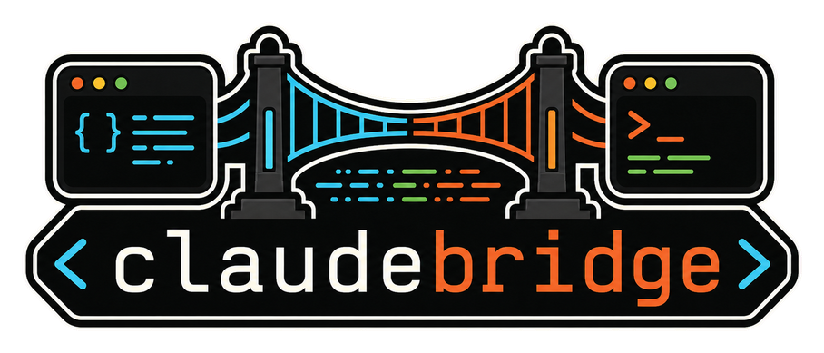
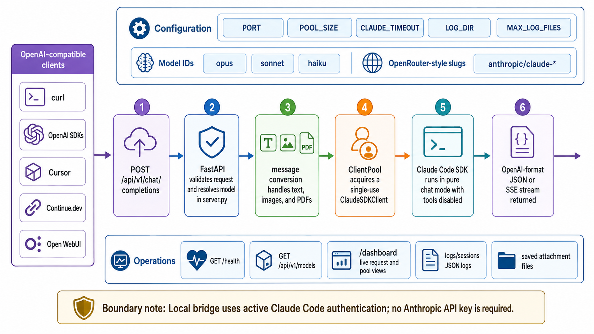

<div align="center">
  

  **🌉 Bridge OpenAI tools to Claude Code SDK — use your subscription anywhere 🔌**
</div>

claudebridge is a local OpenAI-compatible API server for Claude Code SDK. It lets tools that already speak the OpenAI Chat Completions API use your active Claude Code login through `http://localhost:8082/api/v1`.

It supports non-streaming and streaming chat completions, multimodal image/PDF inputs, OpenRouter-style Claude model slugs, a small live dashboard, and JSON session logs for debugging.

> **Legal notice:** claudebridge uses Claude Code SDK access through your Claude subscription, not the Anthropic API. Whether this is allowed under Anthropic's terms is your responsibility to evaluate. Use it conservatively and at your own risk.

## Install

```bash
uv tool install py-claudebridge
claude login
claudebridge
```

Open [http://localhost:8082/dashboard](http://localhost:8082/dashboard), or point an OpenAI-compatible client at `http://localhost:8082/api/v1`.

Install from source when working on the repo:

```bash
git clone https://github.com/tsilva/claudebridge.git
cd claudebridge
uv pip install -e .
claudebridge
```

## Usage

```bash
curl http://localhost:8082/api/v1/chat/completions \
  -H "Content-Type: application/json" \
  -d '{"model": "sonnet", "messages": [{"role": "user", "content": "Hello!"}]}'
```

```python
from openai import OpenAI

client = OpenAI(
    base_url="http://localhost:8082/api/v1",
    api_key="not-needed",
)

response = client.chat.completions.create(
    model="anthropic/claude-sonnet-4",
    messages=[{"role": "user", "content": "Hello!"}],
)
print(response.choices[0].message.content)
```

## Commands

```bash
claudebridge                         # start on http://127.0.0.1:8082
claudebridge --port 8083             # choose another port
claudebridge -w 3                    # run with three pooled workers
claudebridge --version               # print package and git version
uv tool install . --force --no-cache # reinstall local source build
uv run --extra test pytest -m unit   # run unit tests
uv run --extra test pytest           # run full tests; integration tests expect a server
```

## Notes

- Requires Python 3.12+ and an authenticated Claude Code environment from `claude login`.
- Endpoints: `POST /api/v1/chat/completions`, `GET /api/v1/models`, `GET /health`, and `/dashboard`.
- Supported model inputs are `opus`, `sonnet`, `haiku`, or slugs containing those names, such as `anthropic/claude-sonnet-4`.
- `PORT`, `POOL_SIZE`, `CLAUDE_TIMEOUT`, `LOG_DIR`, and `MAX_LOG_FILES` control local runtime behavior.
- Each request gets a fresh or pre-warmed Claude SDK client and the client is destroyed after use.
- Claude Code tools are disabled for SDK sessions. OpenAI-style function calling is emulated by prompting for JSON tool-call output.
- Session logs are written as JSON under `logs/sessions` by default; base64 image and PDF attachments are saved beside their request logs.

## Architecture



## License

[MIT](LICENSE)
